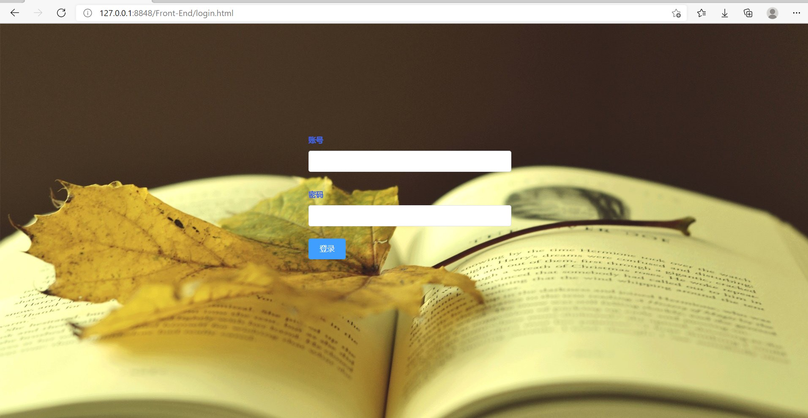

# 基于Servlet的Java图书管理系统

## 开发工具

IDE使用Eclipse-neno、数据库采用MySQL

编辑器采用HBuilderX，服务器采用Tomcat9.0

## 相关技术

总体上采用**前后端分离**的架构

- 主要使用的是**Servlet**

- 前端：使用HTML、CSS、JS以及开源的**ElementUI** 
- 后端：
  - JDBC：该系统的数据全部存储在数据库中，所以通过连接MySQL数据库，然后进行数据的增删改查。
  - 集合类：主要用到了List用于存放从数据库获取的数据，然后将这些数据在放到内存中使用，展示在界面中。
  - 其它
- 前后端交互：使用**Vue**中封装的axios实现**Ajax**技术从而实现前后台分离。

## 功能截图

### 登录

### 首页

